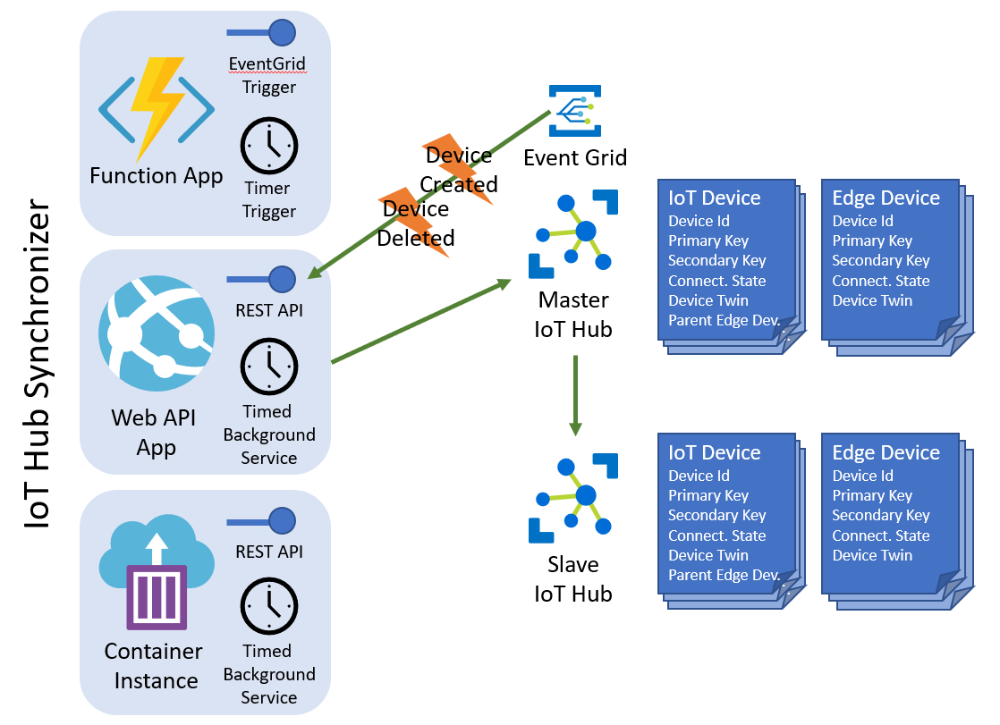
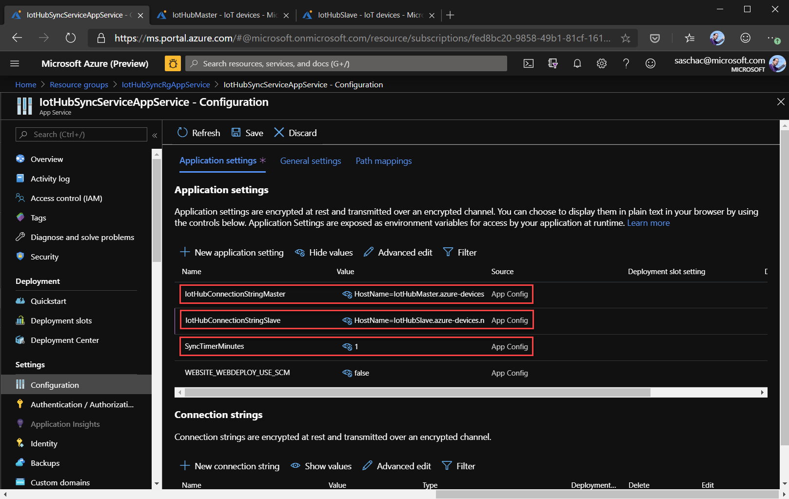
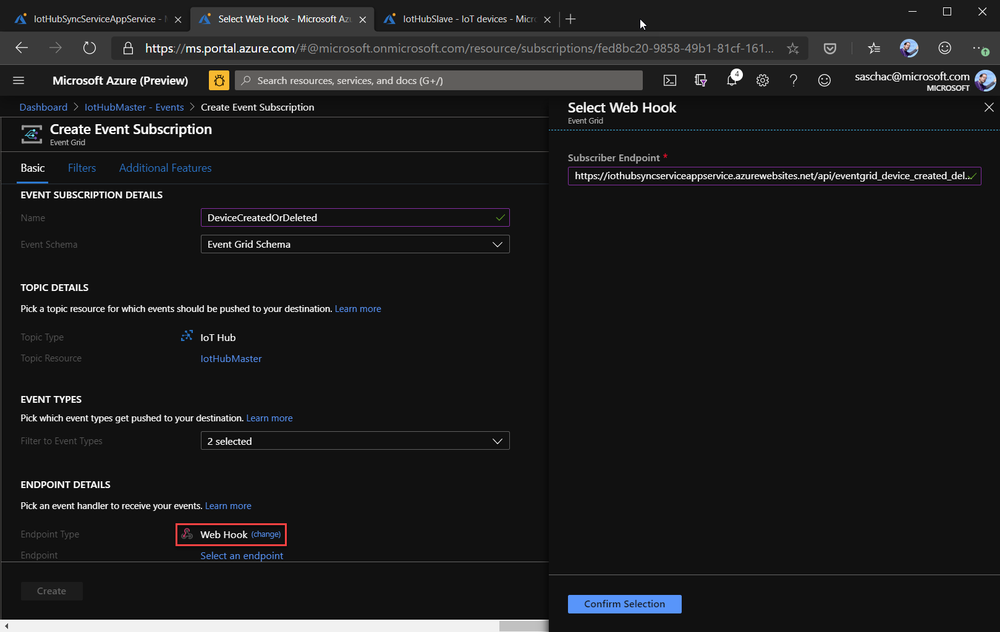
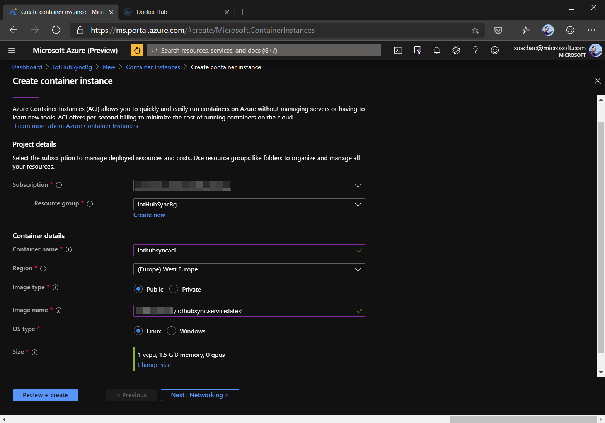
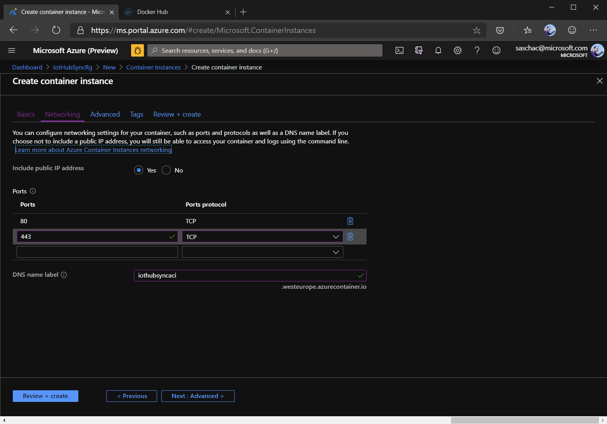
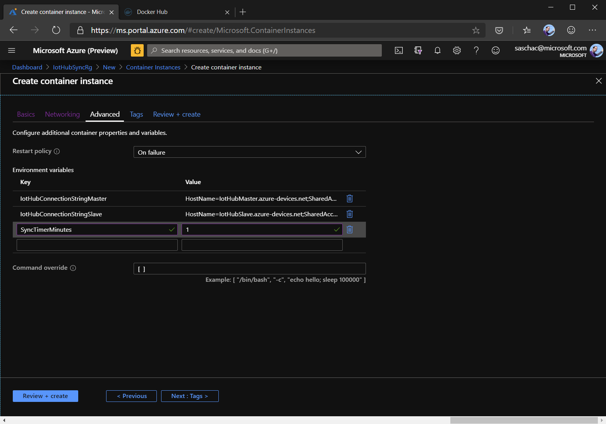

# Azure IoT Hub Synchronizer

The goal of the IoT Hub Syncronizer is to mirror IoT device configurations and IoT Edge device configurations from a master Azure IoT Hub to a slave. It can be run as an Azure function or a WebAPI app. It is triggered either via a timer or via EventGrid events for Azure IoT Hub device creation or deletion.

# Architecture



The IoT Hub Synchronizer syncronizes:

- IoT Hub IoT Devices
  - Device Id
  - Primary Key
  - Secondary Key
  - Connection state to IoT Hub (enable/disable)
  - Device Twin
  - IoT Edge parent device

- IoT Edge Devices
  - Device id
  - Primary Key
  - Secondary Key
  - Connextion state to IoT Hub (enable/disable)
  - Device Twin

## Project Structure

- **/IotHubSync.AzureFunction**: The Azure Function project
- **/IotHubSync.Logic**: The core logic of the IoT Hub Synchronizer
- **/IotHubSync.Service**: The WebAPI app
- **/IotHubSync.TestConsoleApp**: A DotNet Core console app that can be used to test the functionality of the Synchronizer
- **/Dockerfile**: Dockerfile used to build the WebAPI app as a Docker image

## Preparing

Set up two IoT Hubs in Azure, one will be the master/primary, one the slave/secondary. All the changes applied to the master IoT Hub will be mirrored in the slave.

There are multiple ways to host the IoT Hub Synchronizer. See the following sections for detailed descriptions:

- [Host as an Azure Function App](#setting-up-the-azure-function)
- [Host as an Azure Web API App](#setting-up-the-web-api-app)
- [Host as a Docker container](#setting-up-the-docker-image) (for example in an Azure Container Instance)

## Setting up the Azure Function

This chapter targets the `IotHubSync.AzureFunction` project in the solution.

The Azure function app has two functions:

- **EventGridDeviceCreatedOrDeleted**: Gets triggered by Azure Event Grid when a device is created or deleted in the master IoT Hub.
- **TimerTriggerSyncIotHubs**: A timer triggered function that synchronizes any manual changes made to devices in the master IoT Hub.

The time triggered synchronization is configured to run ever full hour but can be changed based on preference.

### Debuggning

To debug the Azure Function App locally, copy the `local.settings.json.sample` file to `local.settings.json` and replace the `IoTHubConnectionStringMaster` and `IoTHubConnectionStringSlave` values to the iothubowner shared access policy of your master- and slave IoT Hubs.

### Deployment

To deploy the Azure Function App, publish it using [Visual Studio's publish function](https://docs.microsoft.com/en-us/azure/azure-functions/functions-develop-vs#publish-to-azure) or [Visual Studio Code](https://docs.microsoft.com/en-us/azure/javascript/tutorial-vscode-serverless-node-01).

In the Azure portal, open your Function App, select `Configuration` and add the following two values to `Application Settings`

- **IotHubConnectionStringMaster**
- **IotHubConnectionStringSlave**

Set them to the iothubowner shared access policy of your master- and slave IoT Hubs.


### Connecting IoT Hub Event Grid Events to the Azure Function

To have the Azure Function App run whenever a device is added to or deleted from the Master IoT Hub, create a subscription for the `Created` and `Deleted` events in IoT Hub that trigger the Azure Function App.

Open the Master IoT Hub and select `Events`. Click on `+ Event Subscription` and fill the form as follows:

- **Event Schema**: `Event Grid Schema`
- **Event Types**: `Device Created` & `Device Deleted`
- **Endpoint Type**: `Azure Function`
- **Endpoint**: `EventGridDeviceCreatedOrDeleted` function of you deployed Azure Function App


### Manual Testing

To verify, that the Azure Function App is working, you can now manually execute a run of the time triggered **TimerTriggerSyncIotHubs** function by selecting this function and hitting the `play` button. You will see the output in the `Logs` section.


You can also see the logs of the functions in their `Monitor` section.


## Setting up the Web API app

This chapter targets the `IotHubSync.Service` project in the solution.

The Web API app has the following REST API:

- **/api/test**: Endpoint to verify if the service is up (may be removed or protected from anonymous access)
- **/api/sync**: Endpoint to manually trigger an IoT Hub synchronization (may be removed or protected from anonymous access)
- **/api/eventgrid_device_created_deleted**: Endpoint that handles Azure Event Grid events when a device is created or deleted in the master IoT Hub.


The time triggered synchronization is configured using the  **SyncTimerMinutes** environment variable / setting.

Set the `IotHubConnectionStringMaster` and `IotHubConnectionStringSlave` in the project's `appsettings.json` file or set the Azure App Service environment variables as describe4d below.

Use the Visual Studio Web API publish wizard to deploy the `IotHubSync.Service` project to an ASP.NET App Service or App Service Linux.

In the Azure portal, you may now set the following environment variables:

- **IotHubConnectionStringMaster**
- **IotHubConnectionStringSlave**
- **SyncTimerMinutes**



After publishing, navigate to the App Service's `/api/test` URL to verify, that it is running. It should respond with "**IotHubSync.Service is up.**"

### Connecting IoT Hub Event Grid Events to the App Service

To have the Azure Function App run whenever a device is added to or deleted from the Master IoT Hub, create a subscription for the `Created` and `Deleted` events in IoT Hub that trigger the Azure App Service.

Open the Master IoT Hub and select `Events`. Click on `+ Event Subscription` and fill the form as follows:

- **Event Schema**: `Event Grid Schema`
- **Event Types**: `Device Created` & `Device Deleted`
- **Endpoint Type**: `Web Hook`
- **Endpoint**: The url of you App service starting with `https://` and ending with `api/eventgrid_device_created_deleted`



You can read the logfiles of the Auzre Web API app after [enabling App Service Logging](https://docs.microsoft.com/en-us/azure/app-service/troubleshoot-diagnostic-logs) in the Azure Portal using the Azure Command Line Interface:

```bash
$ az webapp log tail --resource-group <Resource Group> --name <Web API App Name>  
```

### Testing Event Grid and the App Service locally

To manually debug Azure Event Grid interacting with the code, run the IotHubSync.Service locally and then use [Ngrok](https://ngrok.com/) to make it accessible from the Internet.

```bash
$ .\ngrok.exe http -host-header=rewrite <Local IP port>
```

Use the Ngrok assigned SSL endpoint to configure Azure Event Grid. Events will then be forwarded to your debugger.

## Setting up the Docker Image

You can use the [Dockerfile](./Dockerfile) to build a docker image of the Web API app and then host it i.e. in a Azure Container Instance. You can configure the IotHubConnectionStringMaster, IotHubConnectionStringSlave and SyncTimerMinutes in the [appsettings.json](./IotHubSync.Service/appsettings.json) file or provide them as environment variables using ACI. Make sure to expose TCP port 443 in ACI.







After publishing the ACI, you can read the logfiles using the Azure Command Line Interface:

```bash
$ az container logs --resource-group <Resource Group> --name <ACI Name>
```

## Azure Event Grid Security

In order to work with [Azure Event Grid events](https://docs.microsoft.com/en-us/azure/event-grid/security-authentication), the REST API of the IoT Hub Synchronizer needs to be accessible using a valid, trusted SSL certificate. [Here is how to add your certificate to the Web API app](https://github.com/dotnet/dotnet-docker/blob/master/samples/aspnetapp/aspnetcore-docker-https-development.md) when building it as a Docker image.

## Missing features

- Synchronization of IoT Edge device Modules and Module Twins
- Switch from Newtonsoft.Json to System.Text.Json and System.Text.Json.Serialization.
  - Currently blocked by [this issue](https://github.com/dotnet/corefx/issues/38163) as the *Microsoft.Azure.EventGrid.Model* classes have read-only properties.
