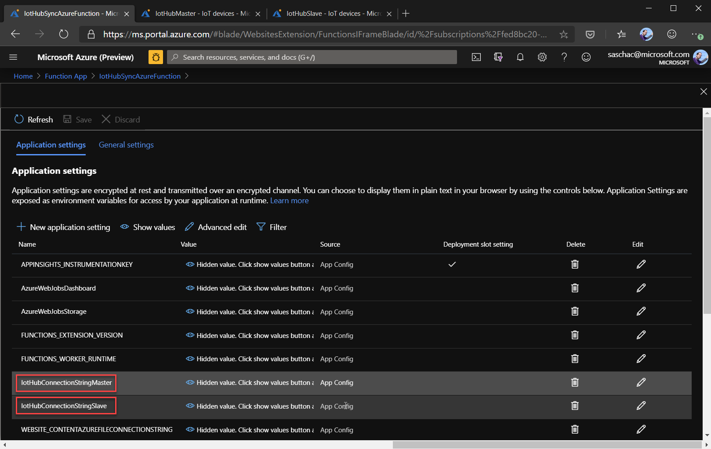
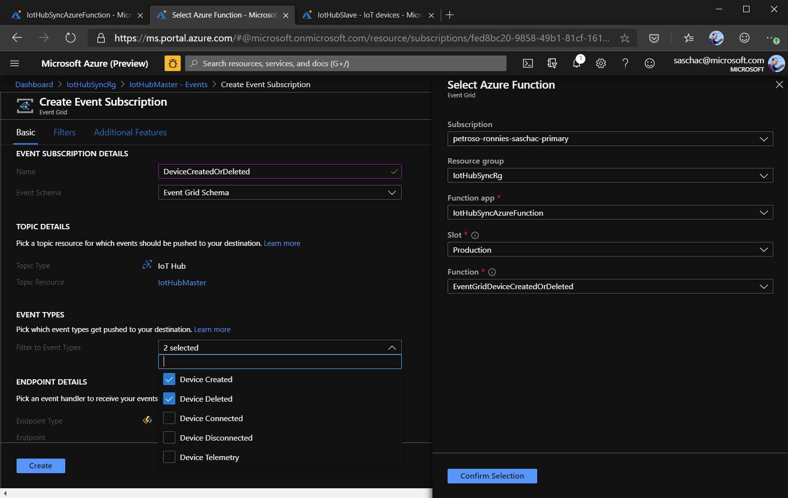
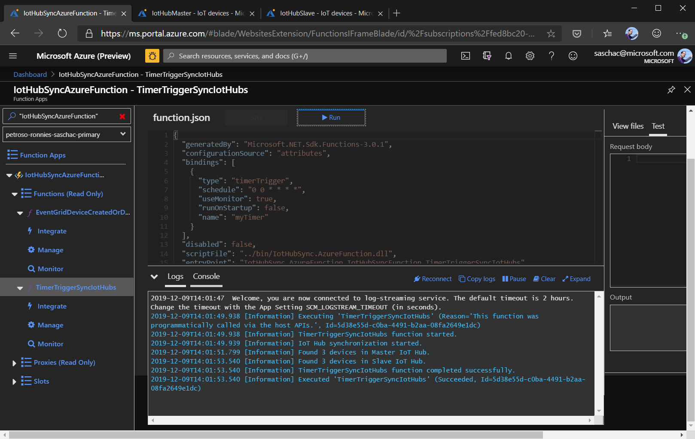
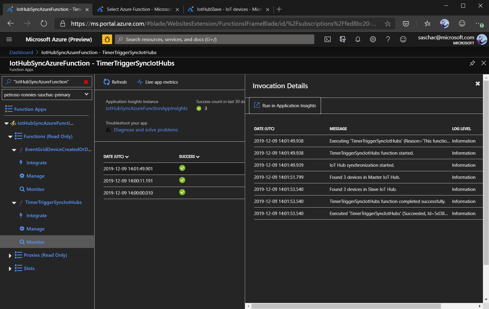

# Iot Hub Synchronizer

The goal of the IoT Hub Syncronizer is to mirror IoT device configurations and IoT Edge device configurations from a master Azure IoT Hub to a slave. It can be run as an Azure function or a WebAPI app. It is triggered either via a timer or via EventGrid events for Azure IoT Hub device creation or deletion.

The IoT Hub Synchronizer syncronizes:

- IoT Hub IoT Devices
  - Device Id
  - Primary Key
  - Secondary Key
  - Connection state to IoT Hub (enable/disable)
  - Device Twin
  - IoT Edge parent device

- IoT Edge Devices
  - Device id
  - Primary Key
  - Secondary Key
  - Connextion state to IoT Hub (enable/disable)
  - Device Twin

## Project Structure

- **IotHubSync.AzureFunction**: The Azure Function project
- **IotHubSync.Logic**: The core logic of the IoT Hub Synchronizer
- **IotHubSync.Service**: The WebAPI app
- **IotHubSync.TestConsoleApp**: A DotNet Core console app that can be used to test the functionality of the Synchronizer.

## Preparing

Set up two IoT Hubs in Azure, one will be the master/primary, one the slave/secondary. All the changes applied to the master IoT Hub will be mirrored in the slave.

## Setting up the Azure Function

This chapter targets the `IotHubSync.AzureFunction` project in the solution.

The Azure function app has three functions:

- **EventGridDeviceCreatedOrDeleted**: Gets triggered by Azure Event Grid when a device is created or deleted in the master IoT Hub.
- **TimerTriggerSyncIotHubs**: A timer triggered function that synchronizes any manual changes made to devices in the master IoT Hub.

The time triggered synchronization is configured to run ever full hour but can be changed based on preference.

To debug the Azure Function App locally, copy the `local.settings.json.sample` file to `local.settings.json` and replace the `IoTHubConnectionStringMaster` and `IoTHubConnectionStringSlave` values to the iothubowner shared access policy of your master- and slave IoT Hubs.

To deploy the Azure Function App, publish it using [Visual Studio's publish function](https://docs.microsoft.com/en-us/azure/azure-functions/functions-develop-vs#publish-to-azure) or [Visual Studio Code](https://docs.microsoft.com/en-us/azure/javascript/tutorial-vscode-serverless-node-01).

In the Azure portal, open your Function App, select `Configuration` and add the following two values to `Application Settings`

- **IotHubConnectionStringMaster**
- **IotHubConnectionStringSlave**

Set them to the iothubowner shared access policy of your master- and slave IoT Hubs.

### Connecting IoT Hub Event Grid Events

To have the Azure Function App run whenever a device is added to or deleted from the Master IoT Hub, create a subscription for the `Created` and `Deleted` events in IoT Hub that trigger the Azure Function App.

Open the Master IoT Hub and select `Events`. Click on `+ Event Subscription` and fill the form as follows:

- **Event Schema**: `Event Grid Schema`
- **Event Types**: `Device Created` & `Device Deleted`
- **Endpoint Type**: `Azure Function`
- **Endpoint**: `EventGridDeviceCreatedOrDeleted` function of you deployed Azure Function App

### Manual Testing

To verify, that the Azure Function App is working, you can now manually execute a run of the time triggered **TimerTriggerSyncIotHubs** function by selecting this function and hitting the `play` button. You will see the output in the `Logs` section.

You can also see the logs of the functions in their `Monitor` section.

## Setting up the WebAPI app

tbd.

## Configuring Azure Event Grid

tbd.

## Missing features

- Synchronization of IoT Edge device Modules and Module Twins
